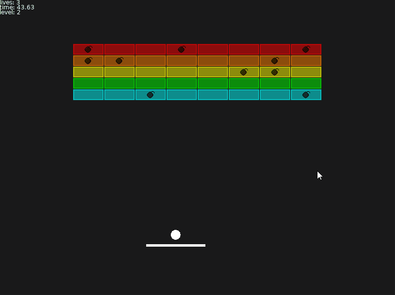
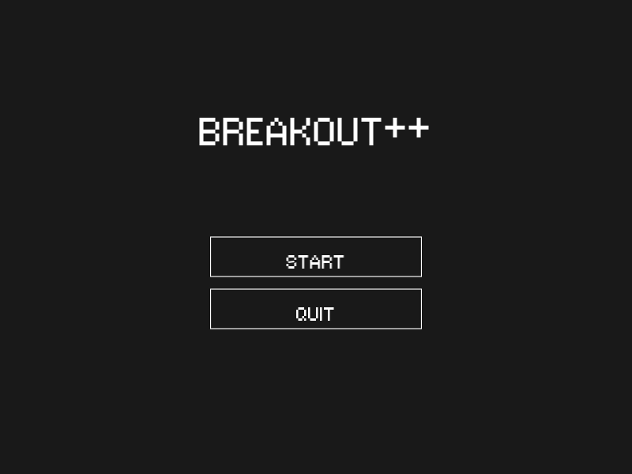
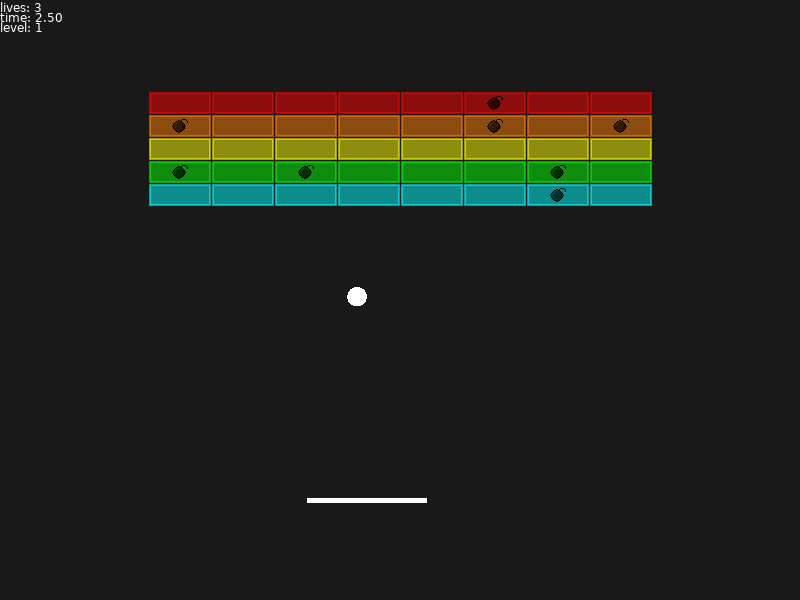

# BREAKOUT++

Simple clone of the arcade game Breakout, with 20% more bombs. Developed using the LOVE2D Lua framework and self-made assets.  

[Download from here](https://github.com/wukelang/breakout/releases)

[itch.io page](https://langdev.itch.io/breakout)

## Gameplay Features
- Controllable bounce angle based on ball-paddle contact point
- Bricks regenerate when all cleared, increasing difficulty and speed
- Randomly generated bomb bricks

## Controls
- Left/Right : move paddle  
- Up: launch ball  
- Space: pause  
- R: reset  
- M: mute sound
- Esc: exit game  

## Screenshots
|   |   |

## Acknowledgements

https://sfxr.me/ - SFX asset generation
